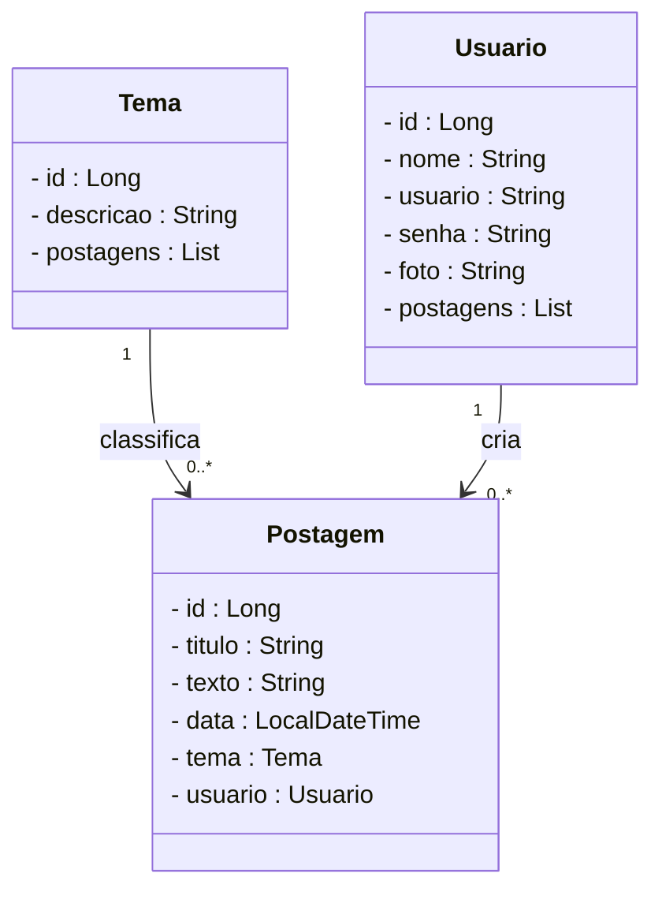
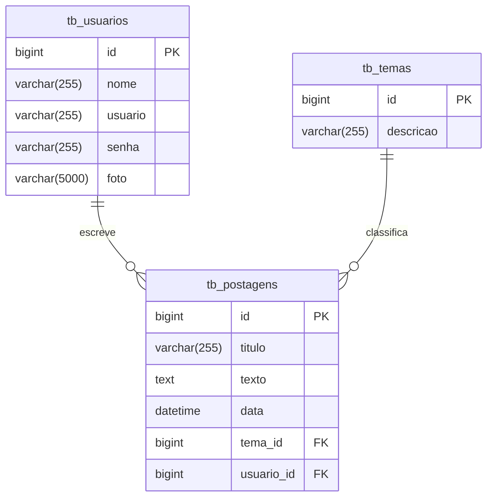

# Projeto Blog Pessoal - Backend com Spring Boot

  

  
  
  
  
  
  

---

## 1. Descrição

Este projeto **Blog Pessoal** foi criado com base em um projeto do meu professor, cujo objetivo é desenvolver uma aplicação que permite que usuários publiquem, editem e visualizem postagens relacionadas a temas variados, de forma organizada e segura. Este projeto foi desenvolvido para fins educacionais, simulando uma aplicação real de blog para praticar conceitos de API REST com Java e Spring Boot.

### Funcionalidades principais:

1. Criação, edição e exclusão de postagens  
2. Associação de postagens a temas específicos  
3. Cadastro e autenticação de usuários  
4. Visualização de postagens por tema ou usuário  
5. Controle de acesso a operações sensíveis  

---

## 2. Sobre esta API

A API do Blog Pessoal foi desenvolvida utilizando **Java** e o **framework Spring**, seguindo a arquitetura MVC e princípios REST. Ela oferece endpoints para gerenciamento dos recursos **Usuário**, **Postagem** e **Tema**, permitindo interação entre usuários e conteúdos.

### 2.1. Funcionalidades principais:

- Consulta, cadastro, login e atualização de usuários  
- Gerenciamento de temas para classificar postagens  
- Criação, edição, listagem e remoção de postagens  
- Associação de postagens a temas e autores  
- Autenticação via token JWT para segurança  

---

## 3. Diagrama de Classes

## Diagrama ER (Modelo de Banco de Dados)

## 4. Tecnologias Utilizadas

| Item                         | Descrição           |
| ---------------------------- | ------------------- |
| **Servidor**                 | Tomcat              |
| **Linguagem de Programação** | Java                |
| **Framework**                | Spring Boot         |
| **ORM**                      | JPA + Hibernate     |
| **Banco de Dados**           | MySQL               |
| **Segurança**                | Spring Security     |
| **Autenticação**             | JWT                 |
| **Testes Automatizados**     | JUnit               |
| **Documentação**             | SpringDoc (Swagger) |

## 5. Requisitos
Para rodar esse projeto localmente, você vai precisar de:

Java JDK 21 ou superior

Banco de dados MySQL

Spring Tools Suite (STS)

Insomnia ou Postman para testar as APIs

## 6. Como executar no STS
### 6.1. Clonando o projeto

git clone https://github.com/carlosmoronisud/Blogpessoal_spring.git

### 6.2. Executando
Abra o projeto no Spring Tools Suite

Na aba Boot Dashboard, localize o projeto

Clique em Start or Restart para iniciar

Acesse http://localhost:8080 no navegador para abrir o Swagger da API

(Lembre-se de configurar o banco de dados antes e de ajustar as configurações do projeto.)

## 7. Contribuições
> Este projeto foi inspirado no repositório do meu professor [Rafael Queiroz](https://github.com/rafaelq80).  
> Veja o projeto original aqui: [blogpessoal_spring_t82](https://github.com/rafaelq80/blogpessoal_spring_t82)

