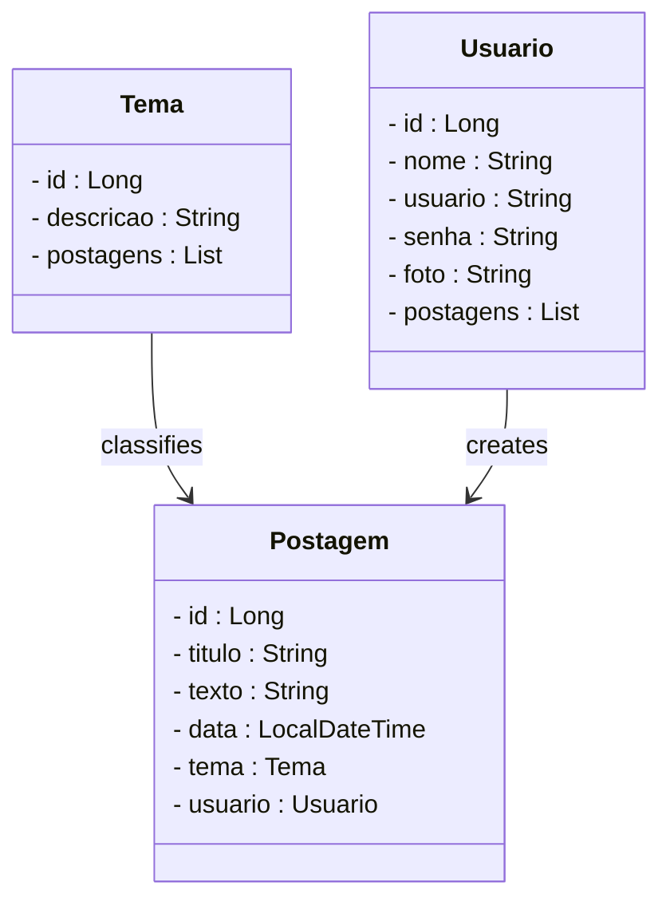
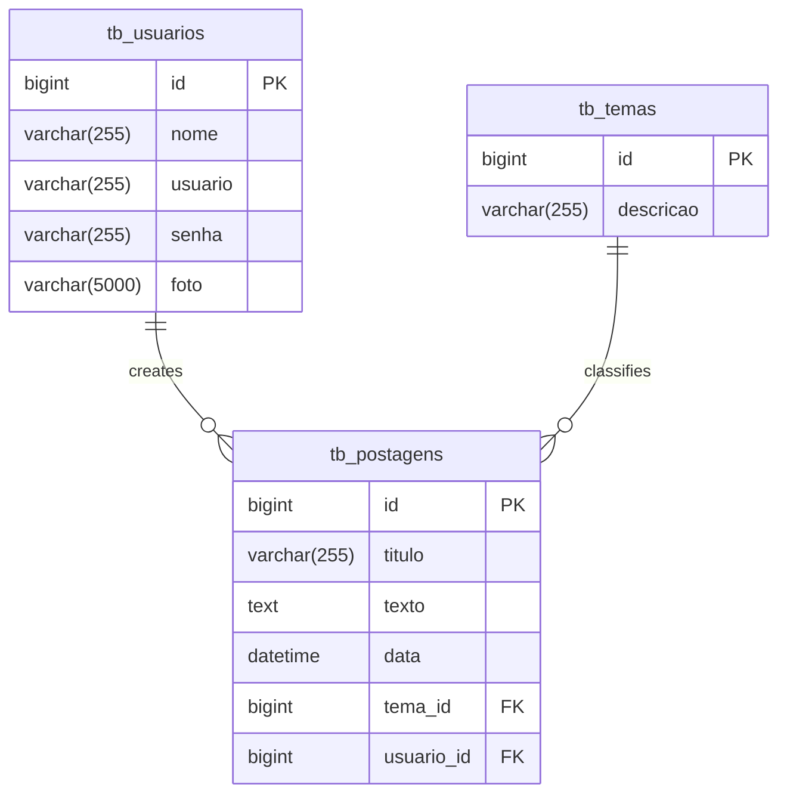

# Personal Blog Project - Spring Boot Backend

 

     

 

  
  
  
  
  
  
  

 

---

## 1. Project Overview

 

The **Personal Blog** is an application that enables users to publish, edit, and view posts on various topics in an organized and secure manner. This project was developed for educational purposes, simulating a real-world blog application to practice **REST API** concepts with Java and Spring Boot.

Key features offered by this personal blog include:

1.  Creating, editing, and deleting posts
2.  Associating posts with specific themes
3.  User registration and authentication
4.  Viewing posts by theme or user
5.  Access control for sensitive operations

 

---

## 2. About This API

 

The Personal Blog API was developed using **Java** and the **Spring framework**, adhering to **MVC** and **REST Architecture** principles. It provides endpoints for managing **User**, **Post**, and **Theme** resources, facilitating interaction between users and published content.

 

### 2.1. Key API Features:

 

1.  Querying, registering, logging in, and updating user data
2.  Querying, creating, and managing themes to classify posts
3.  Creating, editing, listing, and removing posts
4.  Associating posts with themes and authors
5.  Authentication via **JWT token** for secure requests

 

---

## 3. Class Diagram

 

The **Class Diagram** is a visual model used in object-oriented programming to represent a system's structure. It displays classes, attributes, methods, and the relationships between them, such as associations, inheritances, and dependencies.

This diagram aids in planning and understanding the system's architecture, showing how entities interact and connect. It's widely used in the design and documentation phases of projects.

 

 
4. Entity-Relationship Diagram (ERD)
 
The ERD (Entity-Relationship Diagram) for the Personal Blog project visually represents how data is organized in the relational database and how entities relate to each other.
 

 
5. Technologies Used
 

| Item | Description |
|---|---|
| Server | Tomcat |
| Programming Language | Java |
| Framework | Spring Boot |
| ORM | JPA + Hibernate |
| Relational Database | MySQL |
| Security | Spring Security |
| Authentication | JWT |
| Automated Tests | JUnit |
| Documentation | SpringDoc |

 
6. Requirements
 

To run the code locally, you will need:
 * Java JDK 17+
 * MySQL Database
 * STS (Spring Tool Suite)
 * Insomnia or Postman
   
 
7. How to Run the Project in STS
 

7.1. Importing the Project
 * Clone the Personal Blog repository into your STS Workspace folder.
   
   git clone
   [https://github.com/carlosmoronisud/Blogpessoal_spring.git]
   (https://github.com/carlosmoronisud/Blogpessoal_spring.git)

   Note: The original git clone link provided was for a different repository (rafaelq80/blogpessoal_spring_t82).
   I've updated it to match your repository name carlosmoronisud/Blogpessoal_spring for consistency. Please double-check if this is correct.
   
 * Open STS and select the Workspace folder where you cloned the project repository.
 * In the top menu of STS, click: File 🡲 Import...
 * In the Import window, select: General 🡲 Existing Projects into Workspace and click Next.
 * In the Import Projects window, under Select root directory, click Browse... and select the Workspace folder where you cloned the project repository.
 * STS will automatically recognize the project.
 * Select the Personal Blog Project under Projects and click Finish to complete the import.
 * 
 
7.2. Running the Project
 * In the Boot Dashboard tab, locate the Personal Blog Project.
 * Select the Personal Blog Project.
 * Click the Start or Restart button  to start the application.
 * If prompted to authorize network access for the project, click Allow Access.
 * Monitor the project's initialization in the STS console.
 * Verify that the db_blogpessoal database was created correctly and that tables were automatically generated.
 * Use Insomnia or Postman to test the endpoints.

 

> [!TIP]
> By accessing the URL http://localhost:8080 in your browser, the Swagger UI interface will automatically load, allowing you to view and interact with the API endpoints, as well as consult the data models used.
> 
 
8. How to Run Tests in STS
8.1. Locating Test Classes
 * In the Package Explorer, navigate to the src/test/java Source Folder.
 * Locate the classes containing tests (classes whose names end with the word Test).
 
8.2. Executing Tests
You can run tests in two ways:
👉 Option 1: Run a specific test class
 * Right-click on the test class.
 * Select Run As > JUnit Test.
👉 Option 2: Run all project tests
 * Right-click on the project folder.
 * Select Run As > JUnit test.
 
8.3. Verifying Results
 * When tests are executed, the JUnit tab will appear in the Package Explorer, showing the test results.
 * Failing tests will be highlighted in red, and successful ones in green.
 * Click on tests to view details or error messages in the Failure Trace section.
 
9. Contribution
 
This repository is part of an educational project developed by my professor Rafael Queiroz, but contributions are always welcome! If you have suggestions, corrections, or improvements, feel free to:
 * Create an issue.
 * Submit a pull request.
 * Share with colleagues who are learning Java!
 
10. Contact
 
Developed by Carlos Moroni
For questions, suggestions, or collaborations, please reach out via GitHub or open an issue!

---

---
